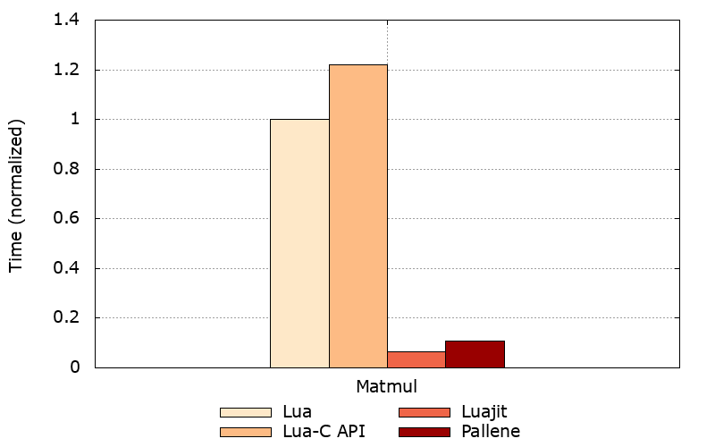

## Contents

- Making Lua Fast
- The Pallene Language
- Performance Evaluation

---

## Making Lua Fast

---

### We Want Lua Programs to Be Fast

What are our options?

- LuaJIT?
- Rewrite it in C?

---

### LuaJIT

- State-of-art JIT compiler for Lua, but...
- Only supports Lua 5.1
- Hard to develop and maintain
- Unpredictable speedups

---

### Idioms Specific to LuaJIT

For instance, caching global functions in local variables.

```
-- Bad
local function mytan(x)
	return math.sin(x) / math.cos(x)
end

-- Good
local sin, cos = math.sin, math.cos
local function mytan(x)
	return sin(x) / cos(x)
end
```

---

But you shouldn't cache FFI functions to locals!

```
-- Good (!)
local function hello()
	C.printf("Hello, world!")
end

-- Bad (!)
local printf = C.printf
local function hello()
	printf("Hello , world!")
end
```

---

### Not Yet Implemented

LuaJIT is not able to compile some Lua features, hence the performance
improvement might not be that good.

- pairs
- string.gsub
- table.sort
- creating closures
- ...

---

### Rewrite it in C

- C-API is great, but...
- Might be difficult for newcomers
- Requires a lot of effort
- It is hard to know in advance if it will be worth it

---

## The Pallene Language

---

### What is Pallene?

Pallene is a companion language for Lua that relies on a static type system and
ahead-of-time compiler to achieve good performance.  

---

Pallene is an academic research project on programing languages at LabLua by
Hugo, myself, and Roberto.

Also check out the original project made by Andre, Fabio, Hisham, Hugo, Sérgio,
and me:  
[https://github.com/titan-lang/titan](https://github.com/titan-lang/titan)

---

### Pallene Should

- Be amenable to standard ahead-of-time compiler optimization techniques
- Be familiar to Lua programmers, syntactically and semantically
- Share the Lua runtime, using the same data representation and the same GC

---

### Dynamic Type System

It is very hard to infer those types and generate fast code.

```
function sum(arr)
	local s = 0
	for i = 1, #arr do
		s = s + arr[i]
	end
	return s
end
```

---

For instance, it could be sending e-mails under the hood.

```
local mt = {
	__len = function(self)
		return #self.emails
	end,
	__index = function(self, i)
		if email.send(self.emails[i]) then
			return 1
		else
			return 0
		end
	end,
}
```

---

### Static Type System

Types limit Pallene's semantics compared to Lua, but they also allow the
compiler to generate fast code ahead of time.

```
function sum(arr: {integer}): integer
	local s = 0
	for i = 1, #arr do
		s = s + arr[i]
	end
	return s
end
```

---

### Interation Between Lua and Pallene

Pallene is able to manipulate Lua's data structures directly.

```
--- Lua code
local array = require'array' -- Pallene library
local a = {1, 2, 3}
print(array.sum(a))
```

---

### Pallene Semantics

Pallene tries to keep the Lua semantics as much as possible.
For instance, a function won't coerce an integer argument to a float parameter.

```
-- Pallene Code:
function add(x: float, y:float): float
	return x + y
end
-- Lua Code:
local big = 18014398509481984 print(add(big, 1) == big)
```

---

### Gradual Guarantee

Pallene is not forced to yield a type error if `copy` receives an array of
strings.

```
function copy(xs: {integer}): {integer}
	local ys: {integer} = {}
	for i = 1, #xs do
		ys[i] = xs[i]
	end
	return ys
end
```

---

### Generating Fast Code Ahead Of Time

Pallene specializes each instruction to the given type and bypass the Lua-C API.

```
int sum(Table *arr)
{
	lua_Integer s = 0;
	for (int i = 1; i != luaH_getn(arr); i++)
	{
		lua_Integer tmp = pallene_get_integer(arr, i);
		s = s + tmp;
	}
	return s;
}
```

---

### Arrays in Pallene

- Pallene uses the same underlying structure that the Lua interpreter does
- According to the gradual guarantee, Pallene code should either behave like
  the equivalent (untyped) Lua code or raise a type error

---

### Array access

The generated code is very specialized when compared to what the Lua
interpreter does.

```
lua_Integer pallene_get_integer(Table *arr, int i)
{
	if (i >= arr->array_capacity)
		resize_array_part(arr, i);
	TValue *slot = &xs->array[i];
	if (slot->tag != LUA_INTEGER)
		pallene_type_error();
	return slot->ivalue;
}
```

---

## Performance Evaluation

---

### Matrix Multiplication



---

### Binary Search


---

### Prime Sieve


---

### N-Queens Problem


---

### Conway's Game of Life


---

### All Results


---

## Questions?

This presentation  
[https://gligneul.github.io/luaworkshop2018](https://gligneul.github.io/luaworkshop2018)

Pallene Language  
[https://github.com/pallene-lang/pallene](https://github.com/pallene-lang/pallene)

SBLP Paper by Hugo M. Gualandi, Roberto Ierusalimschy, Pallene: A statically
typed companion language for Lua.  
[http://www.inf.puc-rio.br/~roberto/docs/pallene-sblp.pdf](http://www.inf.puc-rio.br/~roberto/docs/pallene-sblp.pdf)

Mail me:  
[gligneul `at` puc.inf-rio.br](mailto:)
